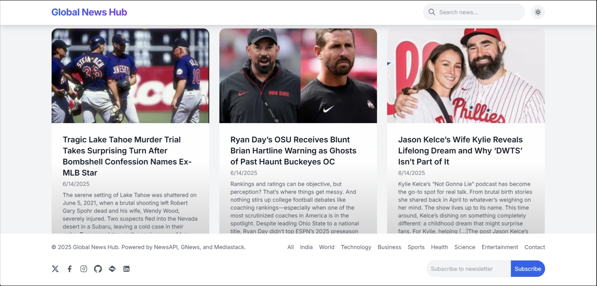

# Global News Hub



Global News Hub is a modern, responsive web application that aggregates and displays news articles from multiple sources using NewsAPI, GNews, and Mediastack. It features a sleek interface with category filters, search functionality, dark/light mode, and a newsletter subscription system powered by EmailJS. The project is deployed at [Will Deploy Later On](https://global-news-three.vercel.app/).

## Features

- **News Aggregation**: Fetches news from NewsAPI, GNews, and Mediastack with fallback support for robust data retrieval.
- **Category Filters**: Browse news by categories like All, India, World, Technology, Business, Sports, Health, Science, and Entertainment.
- **Search Functionality**: Real-time search to find relevant news articles.
- **Dark/Light Mode**: Toggle between dark and light themes with local storage persistence.
- **Responsive Design**: Optimized for mobile, tablet, and desktop devices using Tailwind CSS.
- **Newsletter Subscription**: Subscribe/unsubscribe to newsletters powered by EmailJS, delivering curated news updates.
- **Infinite Scroll**: Loads more articles as you scroll for a seamless experience.
- **Modal View**: Detailed article view in a modal with images, descriptions, and links to original sources.
- **Smooth Animations**: Fade-in effects for news cards and ripple effects for category buttons.
- **Sticky Footer**: Persistent footer with category links and social media icons.

## Technologies Used

- **Frontend**: HTML5, CSS3, JavaScript (ES6+)
- **Styling**: Tailwind CSS, Custom CSS with animations
- **APIs**: NewsAPI, GNews, Mediastack
- **Email Service**: EmailJS for newsletter functionality
- **Deployment**: Vercel
- **Fonts**: Inter (Google Fonts)
- **Icons**: SVG icons for UI elements
- **Version Control**: Git, GitHub

## Prerequisites

- Node.js (for local development and proxy setup)
- Valid API keys for:
  - [NewsAPI](https://newsapi.org/)
  - [GNews](https://gnews.io/)
  - [Mediastack](https://mediastack.com/)
- [EmailJS](https://www.emailjs.com/) account for newsletter functionality

## Setup Instructions

1. **Clone the Repository**:
   ```bash
   git clone https://github.com/Bhavu7/Global-News.git
   cd Global-News
